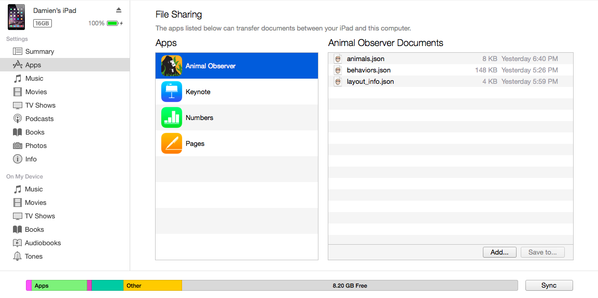

### What is the Animal Observer Toolbox?

AO Toolbox is a user-friendly interface that allows you to fully customize and prepare files needed to run the Animal Observer iOS application, by running an R script in the background. These files---in ".json" format---will allow you to modify the protocol you wish to implement for observational data collection. You do not need any prior R knowledge to use this toolbox. 

Use the tabs above for instructions on how to create the three protocol files:

* <a id="link_to_structure" href="#" class="action-button">behaviors.json</a>
* <a id="link_to_studyanimals" href="#" class="action-button">animals.json</a>
* <a id="link_to_globalvar" href="#" class="action-button">layout_info.json</a> 

Once you have created these files, you can add them to the Animal Observer application. You will need an iPad, an iPad cable, as well as the [iTunes software](http://www.apple.com/itunes/download/) package installed on your computer. Follow these steps:

1. Connect your iPad to the computer and launch iTunes. 
2. Click on the iPad icon 
3. Click on the **Apps** tab. Under **File Sharing** click on the Animal Observer app.
4. Drag and drop the three ".json" protocol files to the **Animal Observer Documents** panel. 
5. Sync your device. 

*N.B.* For additional customization of the application, follow <a id="link_to_customization" href="#" class="action-button">these instructions</a>. These extra files should also be added to the **Animal Observer Documents** panel. 

***

***

<strong>
If you have any questions about the toolbox or the app, please email <a href="mailto:dcaillaud@gorillafund.org" target="_top">Damien Caillaud</a>.
</strong>

***

