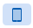
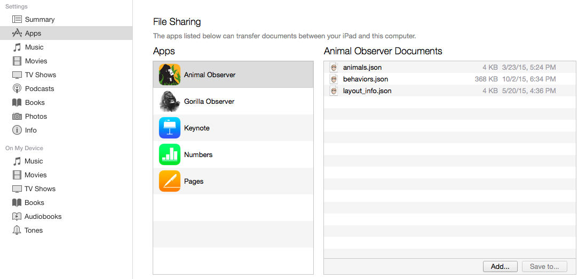

***

### Download data from iPad

1. Connect the iPad to your computer. In the main screen of the application, click on the "Data Upload/Download" button located on the top left corner of the screen. 

2. Click on "Export collected data" to ensure the most up-to-date version of the data file is downloaded. 

3. Launch iTunes on your computer. 

4. Click on the iPad icon 

5. Click on the **Apps** tab in the Settings menu, then click on the Animal Observer app under **File sharing**.
This will open a list of all the Animal Observer documents, including the data file which will be a ".json" file named **"Username_Date_Time.json"**. 

6. Drag and drop this file into a local directory on your computer. 

*N.B. You might also have recorded sound clips or images during the focal. These files will also be found under* **Animal Observer Documents** *and can be saved onto your computer. Any notes taken will be saved in the data file.*

***

 

***

### Convert data to csv

To convert this ".json" file into a set of ".csv" files:

* Upload the ".json" file you downloaded using the panel on the left. You must also upload the **"behaviors.json"** and **"layout_info.json"** files that were used in the app. 

* The data will then be automatically converted into readable ".csv" format and can be downloaded as tables using the "Download" buttons on the left panel. Et voilà!
