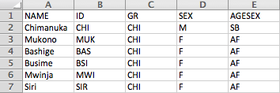
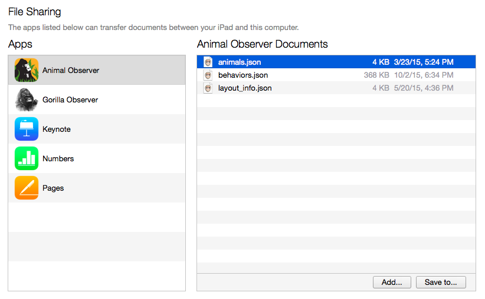

***

The application will also need a file that includes all the individuals being studied. Upload the necessary table (detailed below) and the appropriate file will be automatically generated. 

#### Upload list of study animals

To upload a list of the individuals being observed, create a ".csv" file which specifies the names of these individuals. 

***

Below is an example of what this .csv file can look like:

 

***

This file can include as many variables about group composition as necessary, for example the sex and age. The following columns  are *required*:

* **ID** | to specify the identity of the individuals.  
* **GR** | to specify the group, if multiple social units are being studied.  
* **birthday** | to specicy the birth date of individuals; must be in the format:   "YYYY-MM-DD".  
* **sex** | to specify the sex; can take values F, M, or U.   

Upload the file using the panel on the left and then download the **animals.json** file. 

*N.B. You can view and edit the uploaded .csv file using the <a id="link_to_grp" href="#" class="action-button">Group composition</a> tab above.* 

***

#### Add animals.json file to iPad

* Once this .csv file has been uploaded, click on "Run" and the **animals.json** file will be generated. 

* Connect the iPad to your computer. Launch iTunes on your computer. Click on the **Apps** tab in the Settings menu, then click on the Animal Observer app under **File sharing**. This will open a list called "Animal Observer Documents". Drag and drop the **animals.json** file into this list and sync the device. 

 
