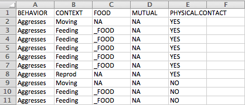
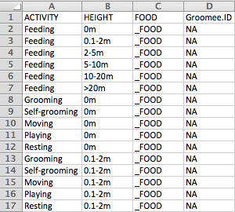
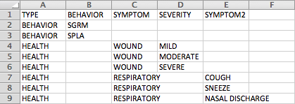
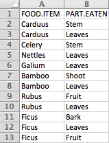
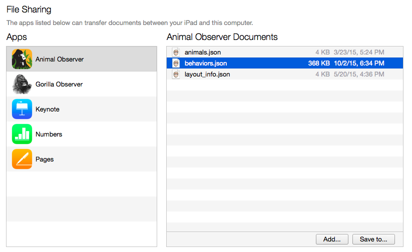

***

To run all the behaviors you wish to record during observations, upload the necessary tables (detailed below) and the appropriate file will be automatically generated. 

#### 1. Upload social behavior (focal) csv file

To upload the list of social behaviors, create a ".csv" file that includes all relevant social behaviors that you wish to record between the focal animal and other individuals in the social unit. 

***

Below is an example of what this .csv file can look like:

 

***

In the above example, the columns BEHAVIOR, CONTEXT, _FOOD, MUTUAL, PHYSICAL.CONTACT were used to specify variables to be recorded during a focal observation. These columns can be edited as required. NOTE: the table above has a column names FOOD, but it should be _FOOD... This will be corrected shortly.

However, if food items are to be recorded and are provided in a separate file, the **_FOOD** column *must* take the following values:

* "NA" or an empty cell
* "_FOOD". This refers to the foods.csv file which specifies all food species relevant to the study. 

(See **4. Upload optional list of food items** below).

The structure of the csv file is important. Each row corresponds to a possible sequence of behavior and modifiers. For exmaple, if you're interested in 3 different behaviors and if each behavior has a single modifier with 4 different levels, you should have 12 rows in your csv file. The structure of the file should be hierarchical, from the leftmost colulmn to the righmost column to match the sequence of behaviors and modifiers you want to display in the pop-up window.

*N.B. You can view and edit the uploaded .csv file using the <a id="link_to_dyad" href="#" class="action-button">Dyadic</a> tab above.* 
    
***
***

#### 2. Upload activity (scan) csv file

To upload a list of activities that will be recorded for each scan, create a ".csv" file that specifies each of these activities and any other associated variables you wish to record during a scan. 

***

Below is an example of what this .csv file can look like:

 

***

As many variables as required may be specified. 

* If the identity of an individual is to be recorded for a certain activity, this must be specified in one of the columns with the value "_ID". This refers to the group composition .csv file (See <a id="link_to_animals" href="#" class="action-button">Study animals</a> for specifications) which lists all individuals being studied. 

* Similarly, if the food item is to be recorded during a scan, this must be specified in the **_FOOD** column with the value "_FOOD". 

*N.B. You can view and edit the uploaded .csv file using the <a id="link_to_scan" href="#" class="action-button">Scan</a> tab above.*

***
***

#### 3. Upload self-directed/health csv file

To upload a list of self-directed behaviors or health parameters, create a ".csv" file that includes the appropriate variables. 

***

Below is an example of what this .csv file can look like:

 

***

This file allows you to specify any self-directed behaviors or health parameters to be recorded for an individual during a scan. The columns can be edited as required. 

*N.B. You can view and edit the uploaded .csv file using the <a id="link_to_solo" href="#" class="action-button">Solo</a> tab above.*

***
***

#### 4. Upload optional list of food items (csv file)

If you wish to record food items during focal and scan observations, upload a list of food items by creating a ".csv" file that includes all food items eaten by the study animal. 

***

Below is an example of what this .csv file can look like:

  
  
***

Create a List of food species relevant to your study. You may specify as many species as required and create additional columns for food parts or types. You may even specifcy food types by genera and species by creating multiple columns. 

*N.B. You can view and edit the uploaded .csv file using the <a id="link_to_foods" href="#" class="action-button">Foods</a> tab above.*

***
***

#### 5. Enter protocol version:

To keep track of which version of the protocol files were used for collected data, specify the version name or number as required. This can be any string of characters. When the protocol files are generated, the version will be saved along with the focal data.  

***
***

#### Add behaviors.json file to iPad

* Once all these .csv files have been uploaded, click on "Run" and the **behaviors.json** file will be generated. 

* Connect the iPad to your computer. Launch iTunes on your computer. Click on the **Apps** tab in the Settings menu, then click on the Animal Observer app under **File sharing**. This will open a list called "Animal Observer Documents". Drag and drop the **behaviors.json** file into this list and sync the device. 

***

 

***

