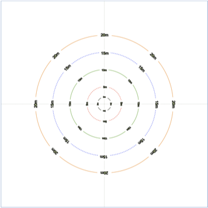
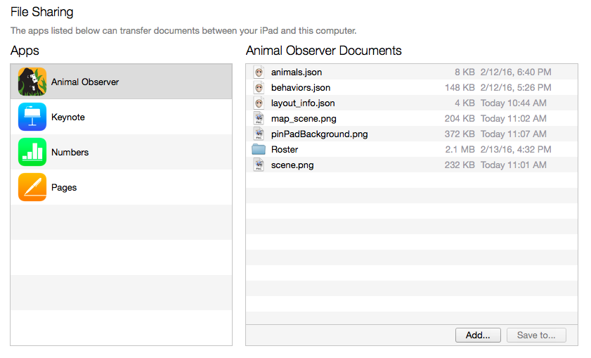

### Addtional Customizations

To further customize the Animal Observer app, you will need to create some extra files and add them to your iPad using iTunes, in the **Animal Observer Documents** panel.
These files are optional and if they are not used, default settings will apply.

**1. Pinpad background image**

* To change the default background that is displayed on the opening pinpad screen, save the image you wish to use with the name "pinPadBackground.png" and add it to iTunes. 

**2. Roster folder**

* To add images for individual animals that will be displayed on the session and focal setup screens of the app, you will need to add a folder called **"Roster"** to iTunes. In this folder, you can add ".jpg" files named according to the ID code of each individual (eg, CAN.jpg for the animal whose ID field in **"animals.json"** is CAN).

* If an image is missing, Animal Observer will pick a default image. To change this default image, just include an image file named "plus_image.jpg" in the **"Roster"** folder. 

**3. Scene background image**

* To change the default scene background on the app interface, save the image you wish to use with the name "scene.png" and add it to iTunes. The scene background is a 2-D representation of the area where animals are observed.

***
The default image is a set of concentric circles labeled with distances (in meters) on which individual animals can be placed. The width of this default background is 60m:

***

* If you add your own image, you will need to modify the "scene_width_meters" variable when you create **"layout_info.json"**. You can modify this <a id="link_to_globalvar2" href="#" class="action-button">here</a> by editing row seven in the second table.

**4. Map scene background image**

* If you use **Map Mode** in the application, you can change the default map scene background. Save the image with the name "map_scene.png" and add it to iTunes. The default map_scene image is provided for testing purposes only.

* If you add your own image, you will need to modify the "map_scene_width_meters" variable when you create **"layout_info.json"**. You can modify this <a id="link_to_globalvar3" href="#" class="action-button">here</a> by editing row nine in the second table.

***

***

